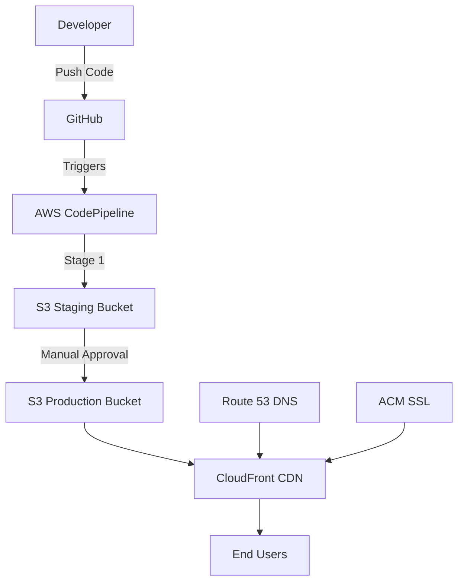

# 📄 Resume Challenge Project

Welcome to my **Resume Challenge Project** repository!  
This project showcases not only my resume but also acts as a full portfolio deployment built with AWS. It highlights my hands-on experience in setting up a static website with a fully automated 2-stage CI/CD pipeline.

---

## 🚀 Project Overview

This project deploys a static website hosted on **Amazon S3**, triggered by code commits pushed to **GitHub**. It uses a 2-stage CI/CD pipeline to deploy first to a **staging environment** and then to **production**.  
This setup demonstrates my **DevOps** and **Cloud Engineering** skills.

---

## ✅ Key AWS Services Used:

- **Amazon S3**: Static website hosting  
- **GitHub**: Source code and version control  
- **AWS CodePipeline**: CI/CD orchestration  
- **Amazon CloudFront**: Content delivery network (CDN)  
- **Amazon Route 53**: DNS management  
- **AWS Certificate Manager (ACM)**: SSL/TLS certificates  

---

## 🧱 Architecture

![Architecture Diagram] portfolio./diagram.png

View as Mermaid Diagram

---

## 🔧 Services Breakdown

- **S3**: Hosts static website files (HTML, CSS, JS)  
- **CodePipeline**:  
  - *Source Stage*: Pulls source from GitHub  
  - *Deploy Stage*: Deploys files to S3  
- **CloudFront**: Speeds up content delivery  
- **Route 53**: Manages custom domain DNS  
- **ACM**: Enables HTTPS via SSL/TLS  

---

## ⚙️ CI/CD Pipeline

### 1. Staging Stage  
- Deploys the latest code to a staging environment  
- Used for testing and review  

### 2. Production Stage  
- Deploys tested changes from staging to production  

---

## 🛠️ Setup Instructions

### Prerequisites

- AWS Account with IAM permissions  
- Registered domain name (e.g., from Route 53 or another provider)  
- Basic knowledge of AWS & GitHub  

### Steps to Set Up

1. **Clone the repository**

git clone https://github.com/anniesingsit/resume-challenge.git
cd resume-challenge

3. **Create an S3 bucket**  
   - Go to AWS Console > S3 > Create bucket  
   - Enable static website hosting

4. **Set up CodePipeline**  
   - Go to CodePipeline > Create pipeline  
   - Connect to GitHub repo  
   - Add a Deploy stage to S3

5. **Configure CloudFront**  
   - Set S3 bucket as origin  
   - Configure caching and viewer settings

6. **Set up Route 53**  
   - Create a hosted zone  
   - Add DNS records pointing to CloudFront

7. **Request SSL/TLS via ACM**  
   - Request a public certificate  
   - Use DNS validation with Route 53

### Deploy  
- Push changes to GitHub  
- CodePipeline automatically deploys to S3

---

## 🌐 Production URL

🔗 [https://singsit.azzyalfie.com](https://singsit.azzyalfie.com)

---

## 🤝 Contributing

Feel free to fork this repo and submit a pull request.  
For major changes, please open an issue first to discuss your ideas.

---

## 📄 License

This project is licensed under the **MIT License**.
